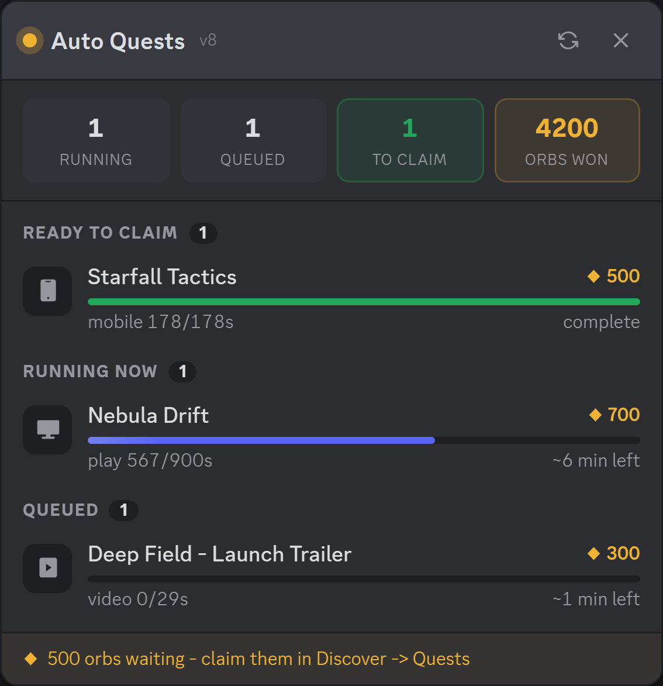
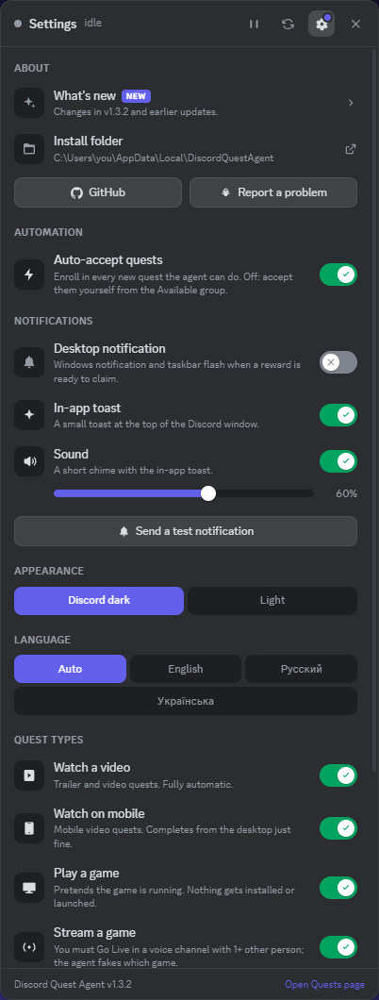
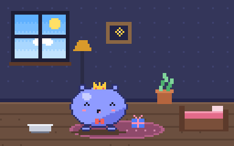
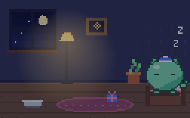
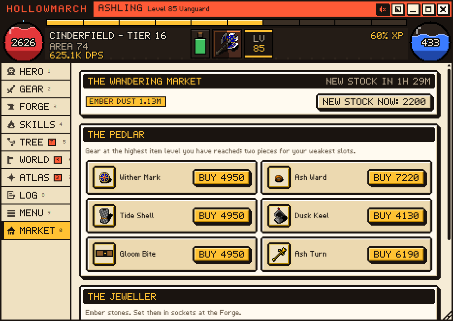
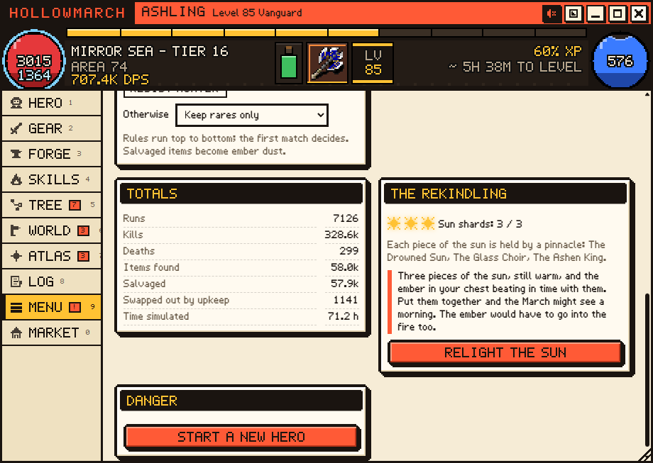

# Discord Quest Agent

**English** · [Русский](README.ru.md)

Finishes Discord quests on its own and puts a live HUD inside the client.

No Vencord, no plugin, no rebuilding anything, and nothing is patched on disk. It attaches
to the desktop client the same way DevTools does and runs a script inside it.

  

Placeholder quest names; the panel shows your real ones.

## ⚠️ Read this first

**Automating quests is almost certainly against Discord's Terms of Service. Use at your
own risk.** Accounts can be actioned for this sort of thing. If your account matters to
you, use an alt.

Two other things worth knowing before you bother installing:

- It **cannot claim rewards for you.** Claiming needs a captcha that's checked server-side.
  The agent gets quests to 100% and then tells you to go press Claim.
- While it runs, Discord has a debugging port open on localhost. Any program on your PC
  can talk to that port and drive your Discord session. See [Security](#security) below.

No warranty, see [LICENSE](LICENSE). You're running this on your own account, by choice.

> Unofficial project, not affiliated with or endorsed by Discord Inc. It ships no Discord
> code, assets or branding, and it doesn't patch anything on disk. Details in
> [NOTICE.md](NOTICE.md).

## ✨ What it does

- Enrolls in eligible quests and completes them: play-a-game, streaming, video,
  mobile-video and activity quests.
- Goes fully idle when there's nothing to do. The poll timer stops, so it makes zero API
  calls until Discord announces new quests. It won't rate-limit you into oblivion.
- Pings you (OS notification + taskbar flash) when a reward is ready to claim.
- Re-injects itself after client reloads, and puts the debugging port back if a Discord
  auto-update strips it. Stays around when you close Discord: start it again by any
  means and the agent restarts it with the port and is back within about a minute.
- Updates itself from this repo. Discord changes its internals every so often and that
  breaks the agent, so a fix here reaches you without you doing anything.

## The HUD

A button shows up in the title bar, just left of the Inbox icon:

  

The badge tells you what's going on without opening anything:

| Badge | Meaning |
| --- | --- |
| 🟢 Green, with a count | That many rewards are sitting there waiting to be claimed |
| 🟡 Amber, with a spinning ring | That many quests are still being worked on |
| ⚪ Grey, with a pause glyph | You paused everything |
| ⚫ Nothing | Idle, nothing to do |

Click it for the panel in the screenshot above: four counters across the top, then one row
per quest with the game's own artwork, the orb reward, a progress bar and the time left.
Rows are grouped into *Ready to claim*, *Running*, *Queued*, *Available* (only when
auto-accept is off) and *Skipped* (with a reason). Drag the header to move it (it stays
where you put it), press Esc to close it. Clicking a quest row, or pressing Enter on it, jumps
straight to the Quests page, where claiming happens.

A reward has to be claimed within 30 days of the quest ending, or it's gone. In the last
week a *Ready to claim* row counts down ("claim within 3 d", red on the last day), and when
one has under 48 hours left the agent sends one reminder. A queued quest that ends within
two days says so too. While idle, the header shows when the agent last checked for quests.

The orb icon is Discord's own: the agent reads it from your running client when it starts,
so nothing of Discord's ships with this project. If a Discord update moves it, the panel
falls back to its own diamond.

### Controls

Hover a row for its buttons:

| Row is... | Buttons |
| --- | --- |
| Ready to claim | **Claim** opens the Quests page |
| Running | **Pause** / **Resume** the task, **Stop** (cancels it and skips the quest) |
| Queued | **Run now** (takes over the one game/stream slot from whatever is using it; that one goes back to the queue), **Skip** |
| Available | **Accept and run**, **Skip** |
| Skipped by you | **Put back in the queue** |
| Failed too often | **Try again** |
| Any *Skipped* row | **Dismiss** hides it from the list (Settings > Maintenance brings them back) |

The header has **Pause everything** (every running quest pauses, nothing new starts; the
same button resumes), **Scan now** and **Settings**. While a play/stream quest is paused the
spoofed game is taken down, so Discord stops sending heartbeats for it until you resume.

### Settings

  

The gear opens Discord-style toggles for **Auto-accept quests**, two kinds of
**notification**, each **quest type** (video, mobile video, play, stream, activity), an
**appearance** switch (Discord dark, the default, or light), a **rescan interval** picker
and maintenance buttons (send a test notification, retry failed quests, clear the skip
list). Switching a type off stops any running quest of that type and parks it under
*Skipped* as "quest type is off"; switching it back on picks them up again.

Notifications when a reward is ready come two ways, each with its own toggle: a **desktop
notification** (Windows toast plus taskbar flash) and an **in-app toast** at the top of the
Discord window. The in-app one uses Discord's own toast system when the agent can find it,
and a look-alike drawn by the agent otherwise, so it works either way. The in-app toast
can bring a short **chime** with it: a **Sound** switch and a **volume** slider sit right
under it, and moving the slider previews the level. Errors stay silent.

Settings and the skip list survive Discord restarts: they're stored inside the client,
per Discord install. `config.json` supplies the defaults, the HUD's choices win over it.

### What's new, and where to report things

The top of Settings has an **About** block. **What's new** opens the changelog
([`CHANGELOG.md`](CHANGELOG.md), shipped with every update): one block per release, newest
first, the installed one marked. After a self-update the agent drops a toast once, and the
gear keeps a dot until you've opened the list, so you know something changed without
reading the repo. Next to it, **GitHub** opens this project in your browser and **Report a
problem** copies the agent's diagnostics to your clipboard and opens a bug report to paste
them into (**Copy diagnostics** under Maintenance does just the copying). **Install folder** opens the folder holding
`Uninstall.bat`, `config.json` and the agent files in Explorer. The changelog is
English-only.

### Stats: your orb pace

Quests come from Discord's partner campaigns, so single days swing between nothing and a
couple of thousand orbs, and weeks between roughly 2k and 8k. Over 30 days that evens out,
which is what makes it useful for planning. The chart button in the header (or a click on
the *orbs won* tile) opens **Stats**:

- **Orbs per 30 days**, big, with the weekly average and the usual range: the same 30-day
  window measured at every week of your history ("usually 14,600 to 18,500"). With less than
  30 days recorded it's projected and says so; the range appears after about 6 weeks.
- Cards for the **last 7 days**, **orbs earned** in total, and orbs **to claim** (click to
  open the Quests page).
- **12 weeks of bars**: claimed in green, still to claim in amber.
- **Saving up for**: type a price in orbs and it tells you roughly how many days that takes
  at your pace, with the spread between a slow and a busy month. Orbs waiting to be claimed
  count toward it.
- **Copy as CSV**: orbs per day, for a spreadsheet.

Discord only lists quests from roughly the last two months, so the agent keeps its own
record, inside the client next to the settings: just the date and the orb amount of each
finished quest, no names or games. Older days are folded into per-day totals. It starts
with whatever Discord still listed when the agent first ran, and days follow your PC's
clock. "Orbs won" on the main view comes from the same record, so it never drops when old
quests expire. Discord doesn't hand the client a live orb balance, so none of this is your
wallet.

### Addons: Orbling, a pixel pet

  
  

Settings > **Addons** holds optional extras; each is off until you switch it on. The first
one is **Orbling**, a tamagotchi-style pet that lives in a small window of its own (the paw
button in the panel header opens it once it's on; drag it by its title bar, Esc closes it,
and it reopens where you left it). It's fed by the agent's work: every orb quest the agent
finishes drops a *star snack* (under 500 orbs) or an *orb feast* (500+) into its bag, and
claiming rewards makes it celebrate.

- Tap the egg to hatch it, then name it. It grows from baby to kid, teen and adult; how you
  raise it decides the adult form (Gourmet, Sprinter, Dapper, Classic, or the rare Astral).
- Four needs (food, fun, energy, clean) drain slowly by the clock, gently at night, when it
  sleeps. It never dies and nothing is lost while you're away; a neglected Orbling just gets
  sad and stops growing. Berries are free, quest food is the good stuff.
- Play with a ball or a 20-second **Orb catch** game (best score kept), clean up after it,
  put it down for a nap, and open the **daily gift** to build a streak.
- Hats to collect (hatching, growing up, 3- and 7-day streaks, a high Orb catch score, a
  seasonal one) and an **album**: after three days as an adult an Orbling can leave on an
  adventure, and a new egg arrives in a colour you haven't collected yet.
- A present appears in its room while quest rewards wait to be claimed (click it for the
  Quests page). A pink dot on the title-bar button means it wants something; an optional
  reminder (at most every 8 hours, never at night) says what.

It's pixel art drawn in code, and it costs nothing while its window is closed: needs are
worked out from timestamps when you look, and the room is only painted while it's on screen.
Its state lives inside Discord next to the settings.

### Addons: Hollowmarch, an idle action RPG

  
   
  
  

**Hollowmarch** is a small action RPG that plays itself in a window of its own. You build
the hero - gear with random affixes, a passive tree, skills and supports, an ascendancy, a
companion at its side - and it clears the road through four acts into an endless map
endgame. Nothing runs while the window is closed: the time away is replayed through the same
simulation when you open it, with a "while you were away" report. Fold it into a mini strip
to keep the fight in a corner, or give it its own button in Discord's title bar. Press F to
step into the Fray and fight the current zone yourself, walking while the skill fires on its own.

Traders with rotating stock, gear sockets and ember stones, companions (the ones not at the
hero's side run errands), feats kept across every dawn, skills that grow with use, an omen
each week that is the same for every player, and a story that ends with relighting the sun
(a new dawn that keeps what you collected). Every October
brings Hollow Night: monsters carrying lanterns, lantern-lit maps and two finds that exist
only then. It follows the agent's language: English, Russian or Ukrainian.

It has nothing to do with quests and never reads quest data or orbs. Details, controls and
the design notes are in [`arpg/README.md`](arpg/README.md).

### Languages

The HUD follows Discord's own language when it has a translation for it, and you can pin
one in Settings. English is built in; Russian and Ukrainian ship as
[`src/locales/ru.json`](src/locales/ru.json) and [`src/locales/uk.json`](src/locales/uk.json).

To add yours: copy [`src/locales/TEMPLATE.json`](src/locales/TEMPLATE.json) to
`locales\<code>.json` inside the install folder (for example
`%LOCALAPPDATA%\DiscordQuestAgent\locales\de.json`), translate the values, and restart the
agent. That folder is never touched by updates, and a file there wins over a shipped one
with the same code. Keys you leave out fall back to English. A pull request with your file
gets it shipped for everyone.

## 📦 Install

1. Grab the [latest release](../../releases/latest) (v1.4.3 or newer), or *Code -> Download ZIP*.
2. Extract it somewhere. Don't run it from inside the ZIP.
3. Double-click `Install.bat`.

It installs to `%LOCALAPPDATA%\DiscordQuestAgent`, adds Start Menu shortcuts and runs at
login (the Startup entry is a `wscript` shortcut to `src\launch.vbs`, which starts the agent
without any window). No admin rights, nothing written outside your user profile.

Then launch it from the Start Menu (**Discord Quest Agent**), or just log out and back in.
Discord restarts once so it can come up with the debugging port.

If something else on your PC already starts Discord with the debugging port (a launcher
script, another tool), install with `Install.bat -AttachOnly`: the agent then only ever
attaches to that Discord and never launches or restarts it itself.

You need Windows 10/11, the Discord desktop app (Stable, PTB or Canary, auto-detected) and
Windows PowerShell 5.1, which is already on your machine.

To remove it, use **Uninstall Quest Agent** in the Start Menu (or run `Uninstall.bat` from
the install folder). It stops the agent, tells the copy living inside Discord to shut down,
restarts Discord once without the debugging port, deletes the shortcuts and the folder, and
tells you if anything couldn't be removed. Nothing is left running and nothing brings it
back at the next login. Add `-KeepDiscord` to skip the Discord restart (the agent then stays
in memory until you restart Discord yourself) or `-KeepConfig` to keep `config.json`.

The uninstaller also lists any *other* startup item on your PC that starts Discord with a
debugging port or runs a quest agent (another tool, an older script). It doesn't touch
those; if it names one, that's what would bring an agent back, so remove it yourself.

## How it works

The Discord desktop client is an Electron app. Started with `--remote-debugging-port`, it
exposes a localhost-only DevTools endpoint. `QuestAgent.ps1` connects to it, finds the
window running Discord's code, and evaluates [`quest-agent.js`](src/quest-agent.js) inside
it. From there the script uses the same internal stores and `/quests/...` endpoints the
client already uses.

## ⚙️ Configuration

`config.json` sits in the install folder. Updates never overwrite it.

| Key | Default | What it does |
| --- | --- | --- |
| `repo` | `BixiSG/discord-quest-agent` | Where self-updates come from |
| `autoUpdate` | `true` | Check for a new version on start |
| `port` | random, 9200-9899 | Debugging port, randomised per machine at install |
| `branch` | `"Auto"` | `Auto`, `Stable`, `Ptb`, `Canary` |
| `restartDiscord` | `true` | Allow restarting Discord to add the debugging port |
| `autoEnroll` | `true` | Accept available quests automatically |
| `scanIntervalMs` | `120000` | How often to look for new quests (paused while idle) |
| `maxTaskAttempts` | `3` | Give up on a quest after this many failed runs |
| `hud` | `true` | Show the button and panel |
| `notify` | `true` | Desktop notification when a reward is claimable |
| `toast` | `true` | In-app toast when a reward is claimable |
| `sound` | `true` | Chime with the in-app toast |
| `volume` | `60` | Chime volume, 0-100 |
| `theme` | `"dark"` | Panel look: `dark` (Discord dark) or `light` |
| `language` | `"auto"` | HUD language: `auto` (follow Discord), `en`, `ru`, `uk`, or a code you added |

`autoEnroll`, `scanIntervalMs`, `notify`, `toast`, `sound`, `volume`, `theme` and `language` are only defaults:
whatever you set in the HUD's Settings view overrides them and is remembered inside Discord.

## 🔒 Security

The port only listens on 127.0.0.1, so nothing on your network can reach it. The problem is
local: while Discord is running with it open, anything on your PC can attach and drive that
Discord session. That's inherent to this approach, not a bug.

The port is randomised per install instead of using a well-known one, which helps a little.
If you're not actively using the agent, start Discord from its own shortcut instead. Setting
`restartDiscord: false` stops the tool from ever restarting your client.

## 🩺 When something breaks

Press **Report a problem** in the HUD's Settings: it copies the diagnostics and opens the bug
form, so you only paste. If the HUD isn't there at all, run the **Quest Agent Diagnostics**
shortcut (or `Start-QuestAgent.bat -Diagnose`) and paste its output instead. Both list
versions, settings and agent state, no tokens or messages.

**No button in the title bar.** Usually the agent isn't running (check for its process in
Task Manager: a PowerShell running `QuestAgent.ps1`), so Discord came up without the
debugging port; start it from the Start Menu shortcut. While the agent runs it catches a
Discord you start by hand and restarts it with the port. If quests are still completing
(notifications arrive, progress moves), the agent is running but couldn't find a slot in
the title bar. The button no longer depends on the English "Inbox" label, so non-English
clients get it too; and if Discord's title bar has no usable slot at all, the agent puts a
small round floating button below the title bar instead, after 20 seconds. Diagnostics
prints `hudButtonMode` (titlebar / floating / none) and `titleBarSlots`; include them in an
issue.

**Discord crashes the instant it starts.** An interrupted Discord update leaves a
newer-but-unfinished `app-<version>` folder on disk: the exe is there, the rest of the
client isn't. Up to v1.0.2 the agent picked whichever folder had the highest version
number, so it kept launching a client that couldn't boot. Since v1.0.3 it starts Discord
through Discord's own `Update.exe` and ignores incomplete builds - diagnostics lists every
build and flags the bad ones. Discord repairs the folder itself on its next update.

**"Quest agent needs updating" notification.** Discord changed its internals. Check for a
newer release; if there isn't one, open an issue with the diagnostics output.

**Nothing happens for a minute after login.** That's expected. It waits for you to finish
logging in and for Discord to register its modules before injecting.

**Play or stream quests stuck at zero.** Those need the desktop app. Streaming quests also
need at least one other person in the voice channel.

**Antivirus complains.** PowerShell that opens a debugging port and injects JavaScript looks
odd to a scanner. The source is all here; read it and decide for yourself.

**It came back after uninstalling.** Something else on the PC is starting Discord with a
debugging port and injecting an agent: an older script, another tool, a leftover Startup
shortcut. The uninstaller prints a list of such items; remove the one it names. This tool
itself leaves no startup entry, scheduled task or registry key behind.

**Internet feels slower while it runs.** Not the agent: its own traffic is a few small JSON
requests (one enroll per quest, a progress ping every 7 s for video quests, a heartbeat
every 20 s for activity quests, one version check at start), and everything else is
localhost. The heavy hitters nearby are a real Go Live stream, which stream quests require
you to run for ~15 minutes, and Discord downloading an update after a restart. Task Manager
-> App history (or Settings -> Network -> Data usage) shows which process actually used the
bandwidth.

Handled task types: `WATCH_VIDEO`, `WATCH_VIDEO_ON_MOBILE`, `PLAY_ON_DESKTOP`,
`STREAM_ON_DESKTOP`, `PLAY_ACTIVITY`. Mobile-video quests complete fine from the desktop
client. `ACHIEVEMENT_IN_ACTIVITY` quests can't be automated and show up as *Skipped*.

## Contributing

The fragile parts are the webpack module finders and the quest config shapes at the top of
`quest-agent.js`. Those are what Discord breaks. PRs welcome.

One rule: **keep the scripts pure ASCII.** PowerShell 5.1 reads BOM-less files using the
system ANSI codepage, so a literal non-ASCII character gets mangled before it ever reaches
Discord. An em dash in the panel turned into three bytes of Cyrillic garbage and cost me an
afternoon. Use `\uXXXX` escapes in JavaScript, and inline SVG instead of symbol glyphs.
The locale files are the one exception: they're plain UTF-8 JSON, because the launcher
reads them as UTF-8 and re-encodes every non-ASCII character as `\uXXXX` before injecting.
Translations are welcome; see *Languages* above.

## 📄 License

[MIT](LICENSE). Trademark and takedown information is in [NOTICE.md](NOTICE.md).
