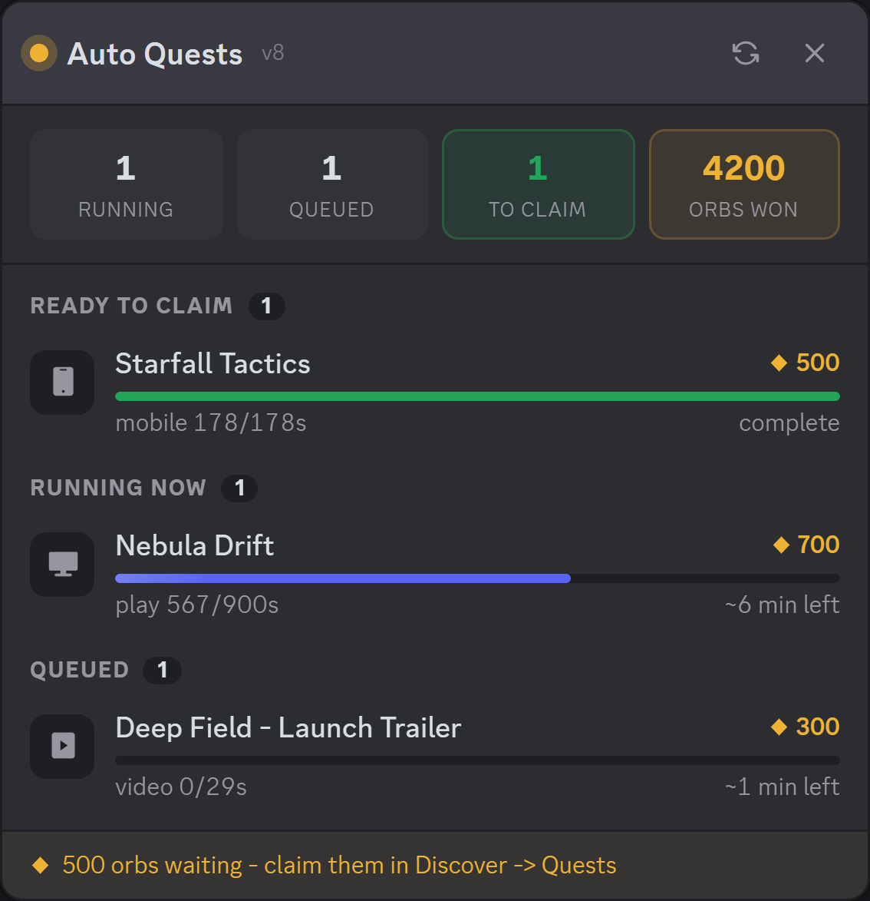
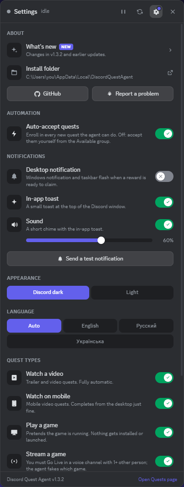

# Discord Quest Agent

[English](README.md) · **Русский**

Сам выполняет квесты Discord и показывает живой HUD прямо в клиенте.

Без Vencord, без плагинов, без пересборки клиента, ничего не патчится на диске. Он
подключается к десктопному клиенту так же, как DevTools, и запускает внутри него скрипт.

  

Названия квестов здесь условные; панель показывает ваши настоящие.

## ⚠️ Сначала прочитайте это

**Автоматизация квестов почти наверняка нарушает условия использования Discord.
Используйте на свой страх и риск.** За такое аккаунты блокируют. Если аккаунт вам дорог,
используйте запасной.

Ещё два момента, о которых стоит знать до установки:

- Он **не может забрать награду за вас.** Для этого нужна капча, которую проверяет
  сервер. Агент доводит квест до 100% и говорит вам пойти нажать «Забрать».
- Пока он работает, у Discord открыт отладочный порт на localhost. Любая программа на
  вашем ПК может подключиться к этому порту и управлять вашей сессией Discord. См.
  [Безопасность](#-безопасность) ниже.

Никаких гарантий, см. [LICENSE](LICENSE). Вы запускаете это на своём аккаунте по своему
решению.

> Неофициальный проект, не связанный с Discord Inc. и не одобренный им. Не содержит кода,
> ресурсов и брендинга Discord и ничего не патчит на диске. Подробности в
> [NOTICE.md](NOTICE.md).

## ✨ Что он делает

- Принимает подходящие квесты и выполняет их: «поиграть», «стримить», «посмотреть видео»,
  «посмотреть на телефоне» и «активность».
- Полностью засыпает, когда делать нечего. Таймер опроса останавливается, так что до
  появления новых квестов он не делает ни одного запроса к API. Никаких рейт-лимитов.
- Уведомляет вас (уведомление Windows, мигание на панели задач и/или всплывающее
  сообщение внутри Discord), когда награду можно забрать.
- Сам переподключается после перезагрузки клиента и возвращает отладочный порт, если его
  снесло автообновление Discord.
- Обновляется из этого репозитория. Discord время от времени меняет внутренности, и это
  ломает агента, поэтому исправление отсюда доезжает до вас без вашего участия.

## HUD

В заголовке окна появляется кнопка, слева от значка «Входящие»:

  

Значок показывает, что происходит, без открытия панели:

| Значок | Значение |
| --- | --- |
| 🟢 Зелёный с числом | Столько наград ждут, пока вы их заберёте |
| 🟡 Янтарный с вращающимся кольцом | Столько квестов сейчас в работе |
| ⚪ Серый со значком паузы | Вы поставили всё на паузу |
| ⚫ Ничего | Ожидание, делать нечего |

Нажмите на неё, чтобы открыть панель со скриншота выше: четыре счётчика сверху, затем по
строке на квест с обложкой игры, наградой в орбах, полосой прогресса и оставшимся временем.
Строки сгруппированы в *Готово к получению*, *В работе*, *В очереди*, *Доступные* (только
когда автоприём выключен) и *Пропущенные* (с причиной). Панель можно перетаскивать за
заголовок, Esc закрывает её. Клик по строке квеста открывает страницу квестов, где и
забираются награды.

### Управление

Наведите на строку, чтобы увидеть её кнопки:

| Состояние строки | Кнопки |
| --- | --- |
| В работе | **Пауза** / **Продолжить**, **Остановить** (отменяет задачу и пропускает квест) |
| В очереди | **Запустить сейчас** (забирает единственный слот игры/стрима у того, кто им занят; тот возвращается в очередь), **Пропустить** |
| Доступный | **Принять и запустить**, **Пропустить** |
| Пропущен вами | **Вернуть в очередь** |
| Слишком много ошибок | **Попробовать снова** |

В заголовке есть **Приостановить всё** (все текущие квесты встают на паузу, новые не
запускаются; та же кнопка продолжает), **Проверить сейчас** и **Настройки**. Пока квест
«поиграть»/«стримить» на паузе, подмена игры снимается, и Discord перестаёт слать по ней
сигналы, пока вы не продолжите.

### Настройки

  

Шестерёнка открывает переключатели в стиле Discord: **автоприём квестов**, два вида
**уведомлений**, каждый **тип квестов** (видео, мобильное видео, игра, стрим, активность),
переключатель **оформления** (тёмная Discord по умолчанию или светлая), выбор **интервала
проверки** и кнопки обслуживания (тестовое уведомление, повторить неудавшиеся квесты,
очистить список пропущенных). Выключение типа останавливает текущие квесты этого типа и
кладёт их в *Пропущенные* с пометкой «тип квеста выключен»; включение обратно снова их
подхватывает.

Уведомление о готовой награде приходит двумя путями, у каждого свой переключатель:
**уведомление Windows** (системное плюс мигание на панели задач) и **всплывающее сообщение
внутри Discord** вверху окна. Второе использует собственную систему уведомлений Discord,
когда агент её находит, а иначе рисует похожее само, так что работает в любом случае.

Настройки и список пропущенных переживают перезапуск Discord: они хранятся внутри клиента,
отдельно для каждой установки Discord. `config.json` задаёт значения по умолчанию, выбор в
HUD важнее.

«Орбов получено» — это сумма по квестам, награды за которые вы уже забрали. Discord не
отдаёт клиенту живой баланс орбов, так что это не ваш кошелёк.

### Языки

HUD следует языку самого Discord, если для него есть перевод, а в настройках язык можно
закрепить. Английский встроен; русский и украинский лежат в
[`src/locales/ru.json`](src/locales/ru.json) и [`src/locales/uk.json`](src/locales/uk.json).

Чтобы добавить свой: скопируйте [`src/locales/TEMPLATE.json`](src/locales/TEMPLATE.json) в
`locales\<код>.json` внутри папки установки (например,
`%LOCALAPPDATA%\DiscordQuestAgent\locales\de.json`), переведите значения и перезапустите
агента. Обновления эту папку не трогают, а файл в ней важнее встроенного с тем же кодом.
Пропущенные ключи берутся из английского. Пришлите файл pull request'ом, и он попадёт ко
всем.

## 📦 Установка

1. Скачайте [последний релиз](../../releases/latest) (v1.2.0 или новее) или *Code -> Download ZIP*.
2. Распакуйте куда-нибудь. Не запускайте прямо из ZIP.
3. Дважды щёлкните `Install.bat`.

Устанавливается в `%LOCALAPPDATA%\DiscordQuestAgent`, добавляет ярлыки в меню «Пуск» и
запускается при входе в систему. Права администратора не нужны, за пределы профиля
пользователя ничего не пишется.

Дальше запустите его из меню «Пуск» (**Discord Quest Agent**) или просто выйдите из системы
и войдите снова. Discord один раз перезапустится, чтобы подняться с отладочным портом.

Нужны Windows 10/11, десктопный Discord (Stable, PTB или Canary, определяется
автоматически) и Windows PowerShell 5.1, который уже есть в системе.

Чтобы удалить, используйте **Uninstall Quest Agent** в меню «Пуск» (или запустите
`Uninstall.bat` из папки установки). Он останавливает агента, просит копию внутри Discord
завершиться, один раз перезапускает Discord без отладочного порта, удаляет ярлыки и папку и
сообщает, если что-то удалить не удалось. Ничего не остаётся запущенным, и ничто не вернёт
его при следующем входе. Добавьте `-KeepDiscord`, чтобы не перезапускать Discord (тогда
агент останется в памяти до вашего перезапуска Discord), или `-KeepConfig`, чтобы сохранить
`config.json`.

Деинсталлятор также перечисляет любые *другие* элементы автозагрузки на вашем ПК, которые
запускают Discord с отладочным портом или запускают агент квестов (другой инструмент,
старый скрипт). Он их не трогает; если он что-то назвал, именно это и вернёт агента, так
что удалите это сами.

## Как это работает

Десктопный клиент Discord — это приложение на Electron. Запущенный с
`--remote-debugging-port`, он открывает DevTools-эндпоинт только на localhost.
`QuestAgent.ps1` подключается к нему, находит окно с кодом Discord и выполняет внутри
[`quest-agent.js`](src/quest-agent.js). Дальше скрипт использует те же внутренние хранилища
и эндпоинты `/quests/...`, что и сам клиент.

## ⚙️ Настройка

`config.json` лежит в папке установки. Обновления его никогда не перезаписывают.

| Ключ | По умолчанию | Что делает |
| --- | --- | --- |
| `repo` | `BixiSG/discord-quest-agent` | Откуда берутся обновления |
| `autoUpdate` | `true` | Проверять новую версию при запуске |
| `port` | случайный, 9200-9899 | Отладочный порт, выбирается случайно при установке |
| `branch` | `"Auto"` | `Auto`, `Stable`, `Ptb`, `Canary` |
| `restartDiscord` | `true` | Разрешить перезапуск Discord ради отладочного порта |
| `autoEnroll` | `true` | Принимать доступные квесты автоматически |
| `scanIntervalMs` | `120000` | Как часто искать новые квесты (в ожидании — пауза) |
| `maxTaskAttempts` | `3` | Отказаться от квеста после стольких неудачных попыток |
| `hud` | `true` | Показывать кнопку и панель |
| `notify` | `true` | Уведомление Windows, когда награду можно забрать |
| `toast` | `true` | Всплывающее сообщение внутри Discord, когда награду можно забрать |
| `theme` | `"dark"` | Вид панели: `dark` (тёмная Discord) или `light` |
| `language` | `"auto"` | Язык HUD: `auto` (как у Discord), `en`, `ru`, `uk` или добавленный вами код |

`autoEnroll`, `scanIntervalMs`, `notify`, `toast`, `theme` и `language` — только значения по
умолчанию: всё, что вы выбрали в настройках HUD, важнее и запоминается внутри Discord.

## 🔒 Безопасность

Порт слушает только 127.0.0.1, так что из сети до него не добраться. Проблема локальная:
пока Discord запущен с открытым портом, любая программа на вашем ПК может подключиться и
управлять этой сессией Discord. Это свойство самого подхода, а не ошибка.

Порт выбирается случайно при установке, а не берётся общеизвестный, что немного помогает.
Если вы не пользуетесь агентом прямо сейчас, запускайте Discord его собственным ярлыком.
`restartDiscord: false` запрещает инструменту когда-либо перезапускать ваш клиент.

## 🩺 Если что-то сломалось

Запустите ярлык **Quest Agent Diagnostics** (или `Start-QuestAgent.bat -Diagnose`) и
вставьте вывод в issue. Там версии, конфиг и состояние агента — без токенов и сообщений.

**Нет кнопки в заголовке окна.** Обычно Discord был запущен не агентом, и отладочного
порта нет; запустите его ярлыком из меню «Пуск». Если квесты при этом выполняются
(приходят уведомления, растёт прогресс), агент работает, но не нашёл места в заголовке.
Кнопка больше не зависит от английской подписи «Inbox», так что неанглийские клиенты тоже
её получают; а если в заголовке Discord вообще нет подходящего места, агент через 20
секунд показывает небольшую круглую плавающую кнопку под заголовком. Диагностика печатает
`hudButtonMode` (titlebar / floating / none) и `titleBarSlots`; приложите их к issue.

**Discord падает сразу при запуске.** Прерванное обновление Discord оставляет на диске
более новую, но недоделанную папку `app-<версия>`: exe есть, остального клиента нет. До
v1.0.2 агент брал папку с самым большим номером версии и раз за разом запускал клиент,
который не мог стартовать. С v1.0.3 он запускает Discord через его собственный `Update.exe`
и пропускает неполные сборки — диагностика перечисляет все сборки и помечает плохие.
Discord сам починит папку при следующем обновлении.

**Уведомление «Quest agent needs updating».** Discord поменял внутренности. Проверьте,
нет ли новой версии; если нет — откройте issue с выводом диагностики.

**После входа в систему минуту ничего не происходит.** Так и задумано. Он ждёт, пока вы
войдёте в аккаунт и Discord зарегистрирует свои модули, и только потом внедряется.

**Квесты «поиграть» и «стримить» стоят на нуле.** Им нужно десктопное приложение. Для
стримов ещё нужен хотя бы один другой человек в голосовом канале.

**Ругается антивирус.** PowerShell, который открывает отладочный порт и внедряет
JavaScript, выглядит для сканера странно. Весь исходный код здесь; прочитайте и решите сами.

**Он вернулся после удаления.** Что-то ещё на ПК запускает Discord с отладочным портом и
внедряет агента: старый скрипт, другой инструмент, забытый ярлык в автозагрузке.
Деинсталлятор печатает список таких элементов; удалите тот, что он назвал. Сам этот
инструмент не оставляет ни элементов автозагрузки, ни задач планировщика, ни ключей
реестра.

**Интернет кажется медленнее, пока он работает.** Это не агент: его собственный трафик —
несколько маленьких JSON-запросов (по одному принятию на квест, отметка прогресса каждые
7 с для видеоквестов, сигнал каждые 20 с для активностей, одна проверка версии при
запуске), а всё остальное — localhost. Тяжёлое рядом — это настоящий стрим (Go Live),
который квесты «стримить» требуют вести ~15 минут, и загрузка обновления Discord после
перезапуска. Диспетчер задач -> Журнал приложений (или Параметры -> Сеть -> Использование
данных) покажет, какой процесс на самом деле съел трафик.

Поддерживаемые типы задач: `WATCH_VIDEO`, `WATCH_VIDEO_ON_MOBILE`, `PLAY_ON_DESKTOP`,
`STREAM_ON_DESKTOP`, `PLAY_ACTIVITY`. Мобильные видеоквесты отлично выполняются с
десктопного клиента. Квесты `ACHIEVEMENT_IN_ACTIVITY` автоматизировать нельзя, они
показываются как *Пропущенные*.

## Участие в разработке

Хрупкие места — искатели webpack-модулей и формы конфигов квестов в начале
`quest-agent.js`. Именно их Discord и ломает. PR приветствуются.

Одно правило: **держите скрипты в чистом ASCII.** PowerShell 5.1 читает файлы без BOM в
системной ANSI-кодировке, поэтому любой не-ASCII символ искажается ещё до того, как
попадёт в Discord. Одно длинное тире в панели превратилось в три байта кириллического
мусора и стоило целого вечера. В JavaScript используйте `\uXXXX`, а вместо символов —
встроенный SVG. Единственное исключение — файлы локализации: это обычный UTF-8 JSON,
потому что лаунчер читает их как UTF-8 и перекодирует каждый не-ASCII символ в `\uXXXX`
перед внедрением. Переводы приветствуются; см. раздел *Языки* выше.

## 📄 Лицензия

[MIT](LICENSE). Информация о товарных знаках и удалении по запросу — в [NOTICE.md](NOTICE.md).
