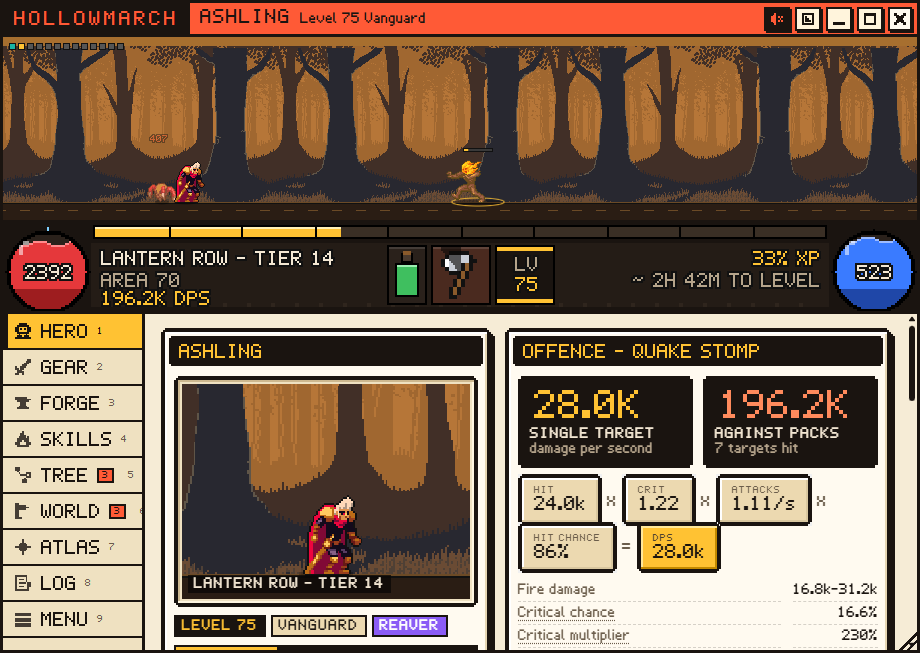

# Hollowmarch

An idle action RPG that runs inside Discord as a Quest Agent addon. You build
the hero - gear with random affixes, a passive tree, skills and supports, an
ascendancy - and the hero fights on its own. Close the window and the road
keeps going: time away is replayed through the same simulation when you come
back, with a "while you were away" report.

It has nothing to do with quests: it never reads quest data or orbs.

## What is in it

- Three callings (Vanguard, Strider, Arcanist), 15 skills, 14 supports.
- Three acts, 21 zones plus three trials, 9 bosses, story beats, six
  ascendancies.
- Items: 300+ bases, 44 affixes with 8 tiers, rares, 10 relics (uniques).
- Crafting: 10 currencies, a forge that turns ember dust into rares, and an
  ordered loot filter.
- A 129-node passive tree with keystones.
- Endgame: maps tier 1-16 with mods, the endless Depths past tier 16, an
  atlas tree and four pinnacle bosses.
- Character sheet with DPS and EHP breakdowns (click a stat to see where it
  comes from), compare deltas on every item and support.

## Install (Windows, with Discord Quest Agent)

1. Install Discord Quest Agent first (`Install.bat` in the repository root).
2. Run `arpg\install\Install-Hollowmarch.bat`. It copies `arpg.js` to
   `%LOCALAPPDATA%\DiscordQuestAgent\addons\`, where the launcher loads
   user-installed addons (they survive agent updates).
3. Restart the agent (or Discord). In the Quest Agent panel open Settings >
   Addons and switch on Hollowmarch. Its card opens the game window.

Uninstall with `arpg\install\Uninstall-Hollowmarch.bat`. The hero stays in
Discord's storage (IndexedDB); Menu > Export gives you a portable copy.

The launcher change that loads `<install>\addons\*.js` lives on this branch;
an agent that has not been updated yet ignores the folder.

## Playing

- The window can be dragged by its title bar and resized from the corner;
  double-click the title to maximize. The title-bar buttons cycle the battle
  view (normal, large, hidden), fold the game into a mini strip that keeps
  playing, maximize and close. Keys: 1-9 switch tabs, Esc closes a dialog.
- Sound is off until you turn it on with the speaker button (or M).
- Folded into the mini strip, the game never opens a dialog inside it: the
  catch-up shows its progress in the strip, news goes to the strip's event
  line, and a report or story beat waits behind a row that brings the full
  window back. Tab, Enter and Space work on item slots and list rows.
- Tabs carry a counter when something waits for you: unspent passive or
  atlas points, a free support slot, a full stash. The strip under the battle
  estimates the time to the next level from the last few minutes.
- In Quest Agent, Settings > Addons can give Hollowmarch its own button in
  Discord's title bar. It opens the game, then works like a taskbar button:
  mini strip and back.
- Nothing runs while the window is closed. Opening it replays the time since
  the last save (up to 24 hours), so the hero is never "paused".
- Auto-push moves on after three clean clears, falls back after three deaths,
  visits trials once the hero out-levels them, and in maps lowers the tier
  after repeated deaths.
- Ember dust comes from salvage. Spend it at the Forge on currency or on a
  fresh rare for a slot.

## Development

Requirements: Node 20+.

    cd arpg
    npm install
    npm run check      # typecheck + 100-odd tests + build (dist/arpg.js, ASCII-checked)
    npm run balance -- 48 3 strider   # headless bot plays 3 heroes for 48 simulated hours

- `src/core` is the pure, deterministic game (no DOM, no clocks, seeded RNG).
  `src/ui` is the Shadow DOM window, `src/platform` the IndexedDB/KV glue.
- Browser: `python dev/serve.py` from the repository root, then open
  `http://127.0.0.1:8765/arpg/dev/play.html` (standalone) or
  `http://127.0.0.1:8765/dev/harness.html?arpg=1&view=addon:arpg` (mock
  Discord with the hub). `npm run smoke` drives the standalone page in
  headless Chromium and fails on console errors.
- `node tools/run-ts.mjs tools/make-save.ts 40 strider /tmp/save.txt` writes
  a bot-played save you can import from the Menu tab.
- Docs: `docs/GDD.md` (design), `docs/COMBAT.md` (every formula),
  `docs/ARCHITECTURE.md`, and the build log in `docs/ai/`.

Names, lore, code, UI and sound are original. Character, monster, effect and
background art comes from CC0 / public-domain packs, credited in
`assets/CREDITS.md` (`node tools/fetch-assets.mjs` then `npm run assets`
rebuilds the sprite atlas).
