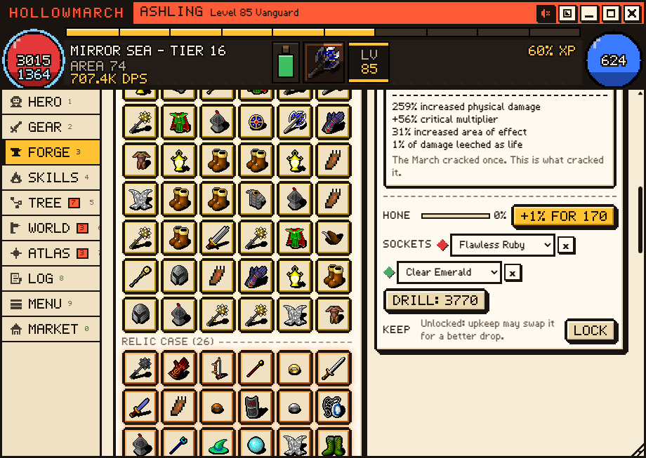
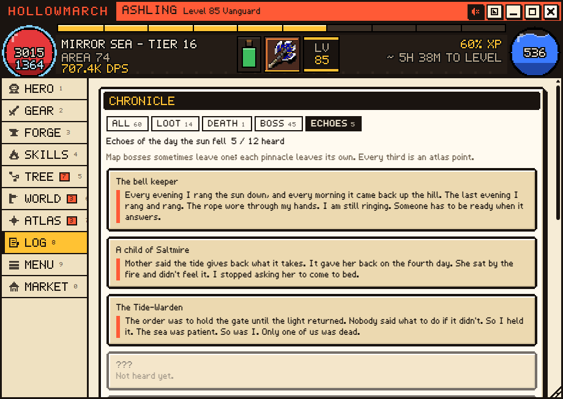
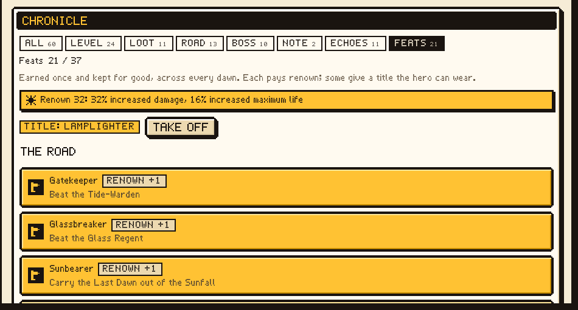
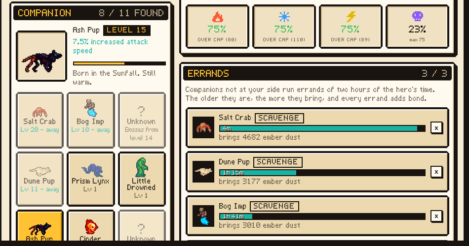
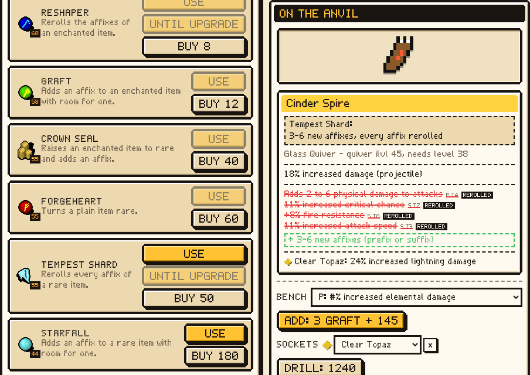
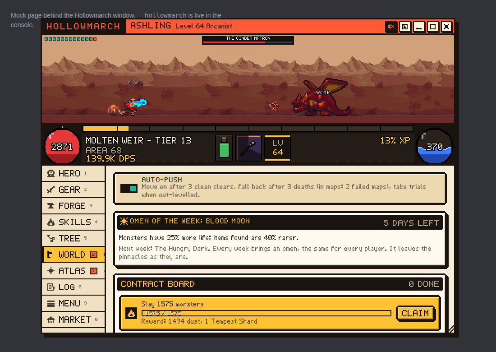
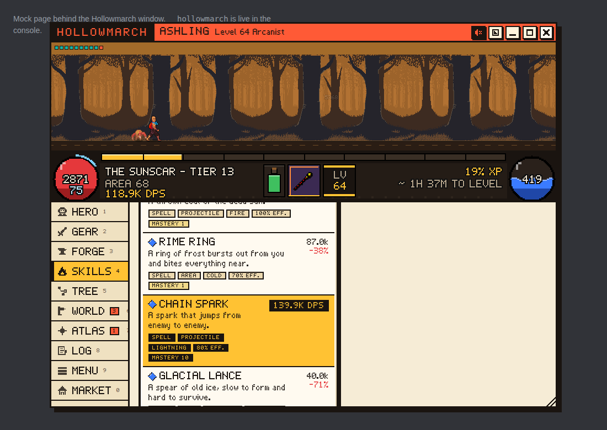

# Hollowmarch

An idle action RPG that runs inside Discord as a Quest Agent addon. You build
the hero - gear with random affixes, a passive tree, skills and supports, an
ascendancy - and the hero fights on its own. Close the window and the road
keeps going: time away is replayed through the same simulation when you come
back, with a "while you were away" report.

It has nothing to do with quests: it never reads quest data or orbs.

## What is in it

- Three callings (Vanguard, Strider, Arcanist), 21 skills, 20 supports (some
  of them defensive, with the EHP they are worth shown next to the DPS).
- Four acts, 28 zones plus four trials, story beats, six ascendancies of
  eight nodes each. Act 4 is Ashfold, the lantern town before the maps.
- Items: 300+ bases, 44 affixes with 8 tiers, rares, 28 relics (uniques) with
  a relic case and a codex.
- A stash that looks after itself: upkeep swaps out the least-worth item for
  a better drop, locks keep what you want, bulk salvage, room for dust.
- Crafting: 10 currencies, hone (quality) and bench (a chosen affix), a forge
  that turns ember dust into rares (or keeps forging until one is an
  upgrade), and an ordered loot filter. Resting on a currency, the hone or
  the bench shows on the item what it would change, add or remove.
- A contract board: three standing goals that pay dust, currency, missing
  relics, companions, maps or sigils.
- Ten companions: one walks at the hero's side and gives a bonus that grows
  with its bond; the others go on two-hour errands for dust, currency, stones
  or maps, and grow too.
- Feats: 38 things done once and kept across every dawn, each paying renown (a
  small permanent bonus); thirteen of them are titles the hero can wear.
- Skill mastery: a skill grows with use (more damage, then less mana, then
  speed), kept across dawns.
- A weekly omen, the same for every player: a trade-off with a reward, from
  a Blood Moon to Clear Skies.
- An ember shrine: timed blessings (experience, rarity, quantity, currency)
  that turn late dust and spare orbs into progress.
- Loot filter presets and affix rules; a pinnacle scout that fights five times
  on a copy of the hero before you spend sigils.
- Sockets and six ember stones whose effect depends on the slot; the
  Wandering Market (a Pedlar and a Jeweller with stock that rotates).
- An ending: twelve echoes of the day the sun fell, three sun shards, and the
  Rekindling - relight the sun and start a new dawn, keeping the collection.
- A 171-node passive tree: nine branches that end in a mastery, six
  keystones (three far out on the ring).
- Endgame: maps tier 1-16 in 13 areas with 18 mods, the endless Depths past
  tier 16, an atlas tree and four pinnacle bosses.
- Character sheet with DPS and EHP breakdowns (click a stat to see where it
  comes from), compare deltas on every item and support.
- Hollow Night every October (the player's calendar): lantern-touched
  monsters, lantern-lit maps, a lantern contract, a seasonal relic and a
  seasonal companion, the Pumpkin Wisp.
- English, Russian and Ukrainian, everything included (story, items, the
  chronicle, the pixel font's Cyrillic); it follows Quest Agent's language.

  
  
  
  
  
  
  
  
  

## Install (Windows, with Discord Quest Agent)

Since Discord Quest Agent 1.7.0, Hollowmarch ships with the agent
(`src\addons\arpg.js`, built from this folder) and updates with it. In the Quest
Agent panel open Settings > Addons and switch on Hollowmarch; its card opens the
game window.

`arpg\install\Install-Hollowmarch.bat` is only for trying a newer build than the
one the agent shipped: it copies `arpg.js` to `%LOCALAPPDATA%\DiscordQuestAgent\addons\`,
where a user-installed file wins over the shipped one of the same name (remove it
with `Uninstall-Hollowmarch.bat`). The hero stays in Discord's storage (IndexedDB)
either way; Menu > Export gives you a portable copy.

## Playing

- The window can be dragged by its title bar and resized from the corner;
  double-click the title to maximize. The title-bar buttons cycle the battle
  view (normal, large, hidden), fold the game into a mini strip that keeps
  playing, maximize and close. Keys: 1-9 switch tabs, Esc closes a dialog.
- Sound is off until you turn it on with the speaker button (or M).
- Folded into the mini strip, the game never opens a dialog inside it: the
  catch-up shows its progress in the strip, news goes to the strip's event
  line, and a report or story beat waits behind a row that brings the full
  window back. Tab, Enter and Space work on item slots and list rows.
- Tabs carry a counter when something waits for you: unspent passive or
  atlas points, a free support slot, a stash upkeep can't make room in, a
  finished contract. The strip under the battle
  estimates the time to the next level from the last few minutes.
- In Quest Agent, Settings > Addons can give Hollowmarch its own button in
  Discord's title bar. It opens the game, then works like a taskbar button:
  mini strip and back.
- Nothing runs while the window is closed. Opening it replays the time since
  the last save (up to 24 hours), so the hero is never "paused".
- Auto-push moves on after three clean clears, falls back after three deaths,
  visits trials once the hero out-levels them, and in maps lowers the tier
  after two failed maps and raises it again after eight clean ones.
- Gear: shift-click stash items to mark them for salvage; L locks the picked
  item. The Relics chip shows the relic case and the codex.
- Ember dust comes from salvage. Spend it at the Forge on currency, honing,
  the bench, a fresh rare for a slot, or more stash room.

## Development

Requirements: Node 20+.

    cd arpg
    npm install
    npm run check      # typecheck + 280-odd tests + build (ASCII-checked)
    npm run balance -- 48 3 strider   # headless bot plays 3 heroes for 48 simulated hours

- The build writes two files: `dist/arpg.js` (readable, for the pages below)
  and `../src/addons/arpg.js` (minified, the one that ships with the agent). Both
  carry the ru/uk tables packed (deflate + base64, `src/i18n/pack.ts`); add
  `&shipped=1` to either page to run the shipped file.
- `src/core` is the pure, deterministic game (no DOM, no clocks, seeded RNG).
  `src/ui` is the Shadow DOM window, `src/platform` the IndexedDB/KV glue.
- Browser: `python dev/serve.py` from the repository root, then open
  `http://127.0.0.1:8765/arpg/dev/play.html` (standalone) or
  `http://127.0.0.1:8765/dev/harness.html?arpg=1&view=addon:arpg` (mock
  Discord with the hub). `npm run smoke` drives the standalone page in
  headless Chromium and fails on console errors. Add `?lang=ru` or `?lang=uk`
  to the standalone page for another language.
- `node tools/run-ts.mjs tools/make-save.ts 40 strider /tmp/save.txt` writes
  a bot-played save you can import from the Menu tab.
- Docs: `docs/GDD.md` (design), `docs/COMBAT.md` (every formula),
  `docs/ARCHITECTURE.md`, and the build log in `docs/ai/`.

Names, lore, code, UI and sound are original. Character, monster, effect and
background art comes from CC0 / public-domain packs, credited in
`assets/CREDITS.md` (`node tools/fetch-assets.mjs` then `npm run assets`
rebuilds the sprite atlas).
